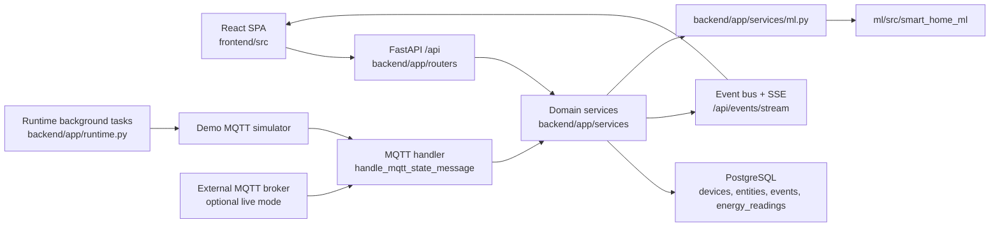

# homeIQ Architecture

## Overview

homeIQ is a three-part system:

- `frontend`: React + Vite SPA for dashboard, devices, automations, events, energy, and ML anomaly views.
- `backend`: FastAPI service that owns auth, API routing, PostgreSQL persistence, SSE, automations, MQTT orchestration, energy aggregation, and demo runtime tasks.
- `ml`: reusable `smart_home_ml` package for feature extraction, model artifact loading, and anomaly scoring.

The public product flow stays under `/api`, while internal runtime/demo flows are handled in backend services and background tasks.

## System Map

## Request and Event Flows

### 1. Normal UI action

1. Frontend sends authenticated request to `/api`.
2. Router validates input and delegates to a domain service.
3. Service updates ORM models and writes domain events/history.
4. Event bus publishes realtime updates to SSE subscribers.
5. Frontend invalidates or patches local caches and refreshes the visible view.

### 2. Demo MQTT event

1. `backend/app/runtime.py` runs a demo loop when `SIM_ENABLED=true`.
2. The loop synthesizes MQTT-style topics and payloads for sensors, motion, light context, and energy meter values.
3. Messages are fed through `handle_mqtt_state_message` instead of direct state mutation.
4. Handler routes state to `set_entity_state`, records `EnergyReading` when the entity is a power/energy meter, and triggers automations/events/SSE.
5. Frontend receives fresh state through polling or SSE without any demo-only API contract.

### 3. Energy and ML graphs

1. Seed/runtime backfills deterministic `EnergyReading` history for the demo home.
2. `/api/energy/summary`, `/api/energy/consumption`, `/api/energy/devices`, and `/api/energy/forecast` aggregate from `energy_readings`.
3. `/api/ml/anomalies` loads power-series rows from `energy_readings`, converts them into ML features, and scores them through the reusable model artifact.
4. Frontend pages `EnergyPage` and `MlAnomaliesPage` render the returned time series directly with Recharts.

## Module Responsibilities

### Frontend

- `src/api`: typed transport, auth token handling, DTOs.
- `src/pages`: route-level product surfaces.
- `src/features/realtime`: SSE connection, fallback polling, cache refresh.
- `src/components`: reusable controls and layout primitives.

### Backend

- `app/routers`: HTTP boundary and public contract.
- `app/services/entities.py`: state mutation, event/history writing, automation kick-off.
- `app/services/mqtt_handler.py`: topic parsing, entity lookup, MQTT-to-domain translation.
- `app/services/energy.py`: read models for dashboard and charts.
- `app/services/energy_ingest.py`: numeric coercion, energy recording, demo profile/history generation.
- `app/services/ml.py`: backend-only adapter between SQL data and the ML package.
- `app/runtime.py`: startup orchestration, database readiness, demo simulator, background tasks.

### ML package

- `smart_home_ml.features`: deterministic feature vectors and frames.
- `smart_home_ml.model`: artifact loading, metadata, severity/reason helpers.
- No FastAPI, DB, or backend imports.

## Demo and Production Boundaries

- Production-style live MQTT can still come from a broker through `mqtt_client` and `mqtt_handler`.
- Demo mode does not need a broker; it reuses the same handler path to stay behaviorally close to production.
- `SIM_ENABLED` is therefore a product demo switch, not a separate fake API mode.
- The ML package remains pure and reusable; all demo-specific generation stays in backend runtime/ingest code.
